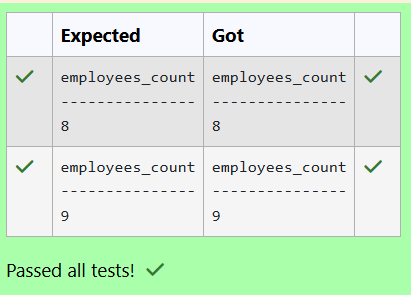
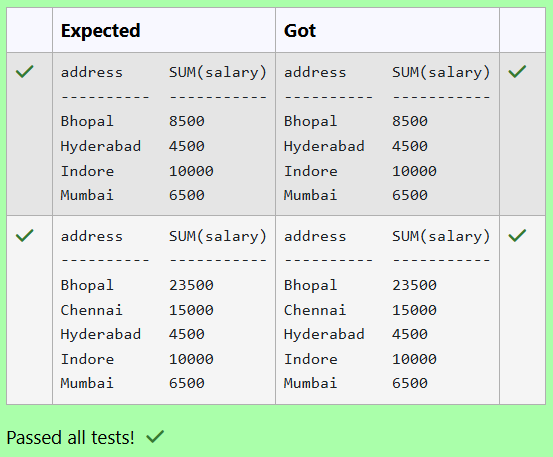
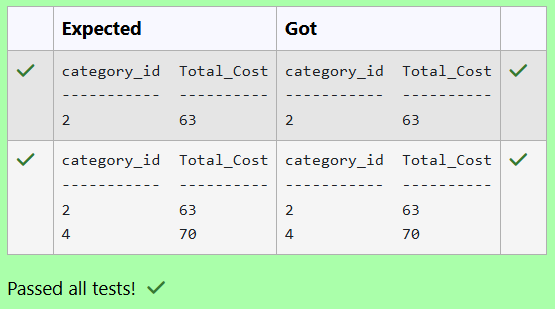

# Experiment 4: Aggregate Functions, Group By and Having Clause

## AIM
To study and implement aggregate functions, GROUP BY, and HAVING clause with suitable examples.

## THEORY

### Aggregate Functions
These perform calculations on a set of values and return a single value.

- **MIN()** – Smallest value  
- **MAX()** – Largest value  
- **COUNT()** – Number of rows  
- **SUM()** – Total of values  
- **AVG()** – Average of values

**Syntax:**
```sql
SELECT AGG_FUNC(column_name) FROM table_name WHERE condition;
```
### GROUP BY
Groups records with the same values in specified columns.

**Syntax:**
```sql
SELECT column_name, AGG_FUNC(column_name)
FROM table_name
GROUP BY column_name;
```
### HAVING
Filters the grouped records based on aggregate conditions.
**Syntax:**
```sql
SELECT column_name, AGG_FUNC(column_name)
FROM table_name
GROUP BY column_name
HAVING condition;
```

**Question 1**
--
How many medical records were created in each month?

Sample table:MedicalRecords Table

.png>)

```sql
SELECT strftime('%Y-%m', Date) AS Month, COUNT(*) AS TotalRecords
FROM MedicalRecords
GROUP BY Month
ORDER BY Month;
```

**Output:**


**Question 2**
---
Write a SQL Query to find how many medications are prescribed for each patient?

Sample table:MedicalRecords Table
 (1).png>)


```sql
SELECT PatientID, COUNT(Medications) AS AvgMedications
FROM MedicalRecords GROUP BY PatientID;
```

**Output:**


**Question 3**
---
How many patients are there in each city?

Sample table: Patients Table

.png>)

```sql
SELECT Address, COUNT(PatientID) AS TotalPatients 
FROM Patients
GROUP BY Address;
```

**Output:**


**Question 4**
---
Write a SQL query that counts the number of unique salespeople. Return number of salespeople.

Sample table: orders
```
ord_no      purch_amt   ord_date    customer_id  salesman_id

----------  ----------  ----------  -----------  -----------

70001       150.5       2012-10-05  3005         5002

70009       270.65      2012-09-10  3001         5005

70002       65.26       2012-10-05  3002         5001
```

```sql
SELECT COUNT(DISTINCT Salesman_id) COUNT FROM orders;
```

**Output:**


**Question 5**
---
Write a SQL query to find how many employees have an income greater than 50K?

Table: employee
```
name        type
----------  ----------
id          INTEGER
name        TEXT
age         INTEGER
city        TEXT
income      INTEGER
```

```sql
SELECT COUNT(id) AS employees_count FROM employee WHERE income > 50000;
```

**Output:**



**Question 6**
---
Write a SQL query to find the average length of email addresses (in characters):

Table: customer
```
name        type
----------  ----------
id          INTEGER
name        TEXT
city        TEXT
email       TEXT
phone       INTEGER
```

```sql
SELECT AVG(LENGTH(email)) AS avg_email_length FROM customer;
```

**Output:**


**Question 7**
---
Write a SQL query to find the total income of employees aged 40 or above.

Table: employee
```
name        type
----------  ----------
id          INTEGER
name        TEXT
age         INTEGER
city        TEXT
income      INTEGER
```

```sql
SELECT SUM(income) AS total_income FROM employee WHERE age >= 40;
```

**Output:**


**Question 8**
---
Write the SQL query that performs grouping by age groups and displays the maximum salary for each group, excluding groups where the maximum salary is not greater than 8000. 

Note: Calculate the age group as multiples of 5.

Eg., 20,22,23 comes in age group 20. 

25,27,29 comes in age group 25.

Sample table: customer1


```sql
SELECT (age/5) * 5 AS age_group, MAX(salary)
FROM customer1
GROUP BY age_group
HAVING MAX(salary) > 8000;
```

**Output:**


**Question 9**
---
Write the SQL query that accomplishes the grouping of data by addresses, calculates the sum of salaries for each address, and excludes addresses where the total salary sum is not greater than 2000.

Sample table: customer1

.png>)

```sql
SELECT address, SUM(salary) FROM customer1 GROUP BY address HAVING SUM(salary) > 2000;
```

**Output:**



**Question 10**
---
Write the SQL query that accomplishes the selection of total cost of all products in each category from the "products" table and includes only those products where the total cost is greater than 50.

Sample table: products

.png>)
```sql
SELECT category_id, SUM(price) AS Total_Cost FROM products GROUP BY category_id HAVING Total_Cost > 50;
```

**Output:**




## RESULT
Thus, the SQL queries to implement aggregate functions, GROUP BY, and HAVING clause have been executed successfully.
