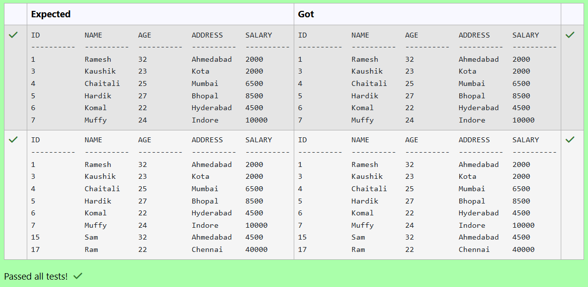
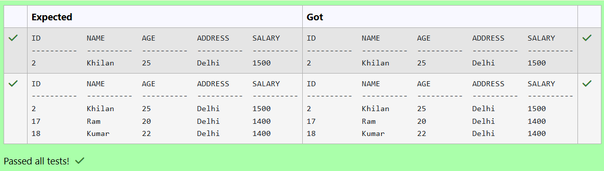
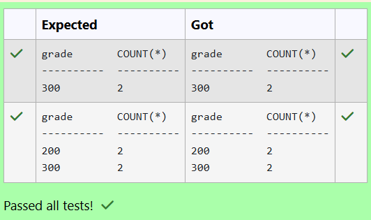

# Experiment 5: Subqueries and Views

## AIM
To study and implement subqueries and views.

## THEORY

### Subqueries
A subquery is a query inside another SQL query and is embedded in:
- WHERE clause
- HAVING clause
- FROM clause

**Types:**
- **Single-row subquery**:
  Sub queries can also return more than one value. Such results should be made use along with the operators in and any.
- **Multiple-row subquery**:
  Here more than one subquery is used. These multiple sub queries are combined by means of ‘and’ & ‘or’ keywords.
- **Correlated subquery**:
  A subquery is evaluated once for the entire parent statement whereas a correlated Sub query is evaluated once per row processed by the parent statement.

**Example:**
```sql
SELECT * FROM employees
WHERE salary > (SELECT AVG(salary) FROM employees);
```
### Views
A view is a virtual table based on the result of an SQL SELECT query.
**Create View:**
```sql
CREATE VIEW view_name AS
SELECT column1, column2 FROM table_name WHERE condition;
```
**Drop View:**
```sql
DROP VIEW view_name;
```

**Question 1**
---
Write a SQL query to retrieve all columns from the CUSTOMERS table for customers whose salary is greater than $1500.

Sample table: CUSTOMERS
```
ID          NAME        AGE         ADDRESS     SALARY
----------  ----------  ----------  ----------  ----------

1          Ramesh         32         Ahmedabad     2000
2          Khilan         25         Delhi         1500
3          Kaushik        23         Kota          2000
4          Chaitali       25         Mumbai        6500
5          Hardik         27         Bhopal        8500
6          Komal          22         Hyderabad     4500
7          Muffy          24         Indore        10000
```

```sql
SELECT * FROM CUSTOMERS WHERE salary > 1500;
```

**Output:**



**Question 2**
---
Write a SQL query to Find employees who have an age less than the average age of employees with incomes over 2.5 Lakh

Employee Table
```
name             type
------------   ---------------
id              INTEGER
name            TEXT
age             INTEGER
city            TEXT
income          INTEGER
```
```sql
SELECT * FROM Employee WHERE age < (SELECT AVG(age) FROM Employee WHERE income > 250000); 
```

**Output:**


**Question 3**
---
From the following tables write a SQL query to find salespeople who had more than one customer. Return salesman_id and name.

salesman table
```
name                 type
---------------   ---------------
salesman_id         numeric(5)
name                varchar(30)
city                varchar(15)
commission          decimal(5,2)
```
customer table
```
name                type
-----------       ----------
customer_id         int
cust_name           text
city                text
grade               int
salesman_id         int
```
```sql
SELECT s.salesman_id, s.name
FROM salesman s
JOIN (
    SELECT salesman_id
    FROM customer
    GROUP BY salesman_id
    HAVING COUNT(customer_id) > 1
) c ON s.salesman_id = c.salesman_id;
```

**Output:**


**Question 4**
---
Write a SQL query to retrieve all columns from the CUSTOMERS table for customers whose salary is greater than $4500.

Sample table: CUSTOMERS
```
ID          NAME        AGE         ADDRESS     SALARY
----------  ----------  ----------  ----------  ----------

1          Ramesh         32         Ahmedabad    2000
2          Khilan         25         Delhi        1500
3          Kaushik        23         Kota         2000
4          Chaitali       25         Mumbai       6500
5          Hardik         27         Bhopal       8500
6          Komal          22         Hyderabad    4500
7          Muffy          24         Indore       10000
```

```sql
SELECT * FROM CUSTOMERS WHERE SALARY > 4500;
```

**Output:**


**Question 5**
---
Write a SQL query to Retrieve the names and cities of customers who have the same city as customers with IDs 3 and 7

SAMPLE TABLE: customer
```
name             type
---------------  ---------------
id               INTEGER
name             TEXT
city             TEXT
email            TEXT
phone            INTEGER
```
```sql
SELECT name, city FROM customer 
WHERE city IN (SELECT city FROM customer WHERE id IN (3, 7));
```

**Output:**


**Question 6**
---
Write a SQL query to retrieve all columns from the CUSTOMERS table for customers whose Address as Delhi and age below 30

Sample table: CUSTOMERS
```
ID          NAME        AGE         ADDRESS     SALARY
----------  ----------  ----------  ----------  ----------

1          Ramesh         32        Ahmedabad    2000
2          Khilan         25        Delhi        1500
3          Kaushik        23        Kota         2000
4          Chaitali       25        Mumbai       6500
5          Hardik         27        Bhopal       8500
6          Komal          22        Hyderabad    4500
7          Muffy          24        Indore       10000
```

```sql
SELECT * FROM CUSTOMERS WHERE ADDRESS = 'Delhi' AND AGE < 30 ORDER BY ID;
```

**Output:**



**Question 7**
---
From the following tables, write a SQL query to find those salespeople who earned the maximum commission. Return ord_no, purch_amt, ord_date, and salesman_id.

salesman table
```
name             type
---------------  ---------------
salesman_id      numeric(5)
name             varchar(30)
city             varchar(15)
commission       decimal(5,2)
```
orders table
```
name             type
---------------  --------
order_no         int
purch_amt        real
order_date       text
customer_id      int
salesman_id      int
 ```
```sql
SELECT o.ord_no, o.purch_amt, o.ord_date, o.salesman_id
FROM orders o
JOIN salesman s ON o.salesman_id = s.salesman_id
WHERE s.commission = (
    SELECT MAX(commission)
    FROM salesman
);
```

**Output:**


**Question 8**
---
Write a SQL query to retrieve all columns from the CUSTOMERS table for customers whose AGE is LESS than $30

Sample table: CUSTOMERS
```
ID          NAME        AGE         ADDRESS     SALARY
----------  ----------  ----------  ----------  ----------

1          Ramesh         32        Ahmedabad    2000
2          Khilan         25        Delhi        1500
3          Kaushik        23        Kota         2000
4          Chaitali       25        Mumbai       6500
5          Hardik         27        Bhopal       8500
6          Komal          22        Hyderabad    4500
7          Muffy          24        Indore       10000
```
```sql
SELECT * FROM CUSTOMERS WHERE AGE < 30;
```

**Output:**


**Question 9**
---
From the following tables write a SQL query to count the number of customers with grades above the average in New York City. Return grade and count.

customer table
```
name         type
-----------  ----------
customer_id  int
cust_name    text
city         text
grade        int
salesman_id  int
```
```sql
SELECT grade, COUNT(*) FROM customer
WHERE grade > (SELECT AVG(grade) FROM customer WHERE city = 'New York') GROUP BY grade;
```

**Output:**



**Question 10**
---
Write a SQL query to retrieve all columns from the CUSTOMERS table for customers whose Address as Delhi

Sample table: CUSTOMERS
```
ID          NAME        AGE         ADDRESS     SALARY
----------  ----------  ----------  ----------  ----------

1          Ramesh         32        Ahmedabad     2000
2          Khilan         25        Delhi         1500
3          Kaushik        23        Kota          2000
4          Chaitali       25        Mumbai        6500
5          Hardik         27        Bhopal        8500
6          Komal          22        Hyderabad     4500
7          Muffy          24        Indore        10000
```

```sql
SELECT * FROM CUSTOMERS WHERE ADDRESS = 'Delhi';
```

**Output:**


## RESULT
Thus, the SQL queries to implement subqueries and views have been executed successfully.
