# Experiment 6: Joins

## AIM
To study and implement different types of joins.

## THEORY

SQL Joins are used to combine records from two or more tables based on a related column.

### 1. INNER JOIN
Returns records with matching values in both tables.

**Syntax:**
```sql
SELECT columns
FROM table1
INNER JOIN table2
ON table1.column = table2.column;
```

### 2. LEFT JOIN
Returns all records from the left table, and matched records from the right.

**Syntax:**

```sql
SELECT columns
FROM table1
LEFT JOIN table2
ON table1.column = table2.column;
```
### 3. RIGHT JOIN
Returns all records from the right table, and matched records from the left.

**Syntax:**

```sql
SELECT columns
FROM table1
RIGHT JOIN table2
ON table1.column = table2.column;
```
### 4. FULL OUTER JOIN
Returns all records when there is a match in either left or right table.

**Syntax:**

```sql
SELECT columns
FROM table1
FULL OUTER JOIN table2
ON table1.column = table2.column;
```

**Question 1**
---
Write the SQL query that achieves the selection of all columns from the "nurses" table (aliased as "n"), with an inner join on the "department_id" column and a condition filtering for nurses in the 'Pediatrics' department.

NURSES TABLE:

ATTRIBUTES - nurse_id, first_name, last_name, department_id
.png>)


DEPARTMENTS TABLE:

ATTRIBUTES - department_id, department_name
.png>)

```sql
SELECT n.* FROM NURSES n
INNER JOIN DEPARTMENTS d
ON n.department_id = d.department_id 
WHERE department_name = 'Pediatrics';
```

**Output:**

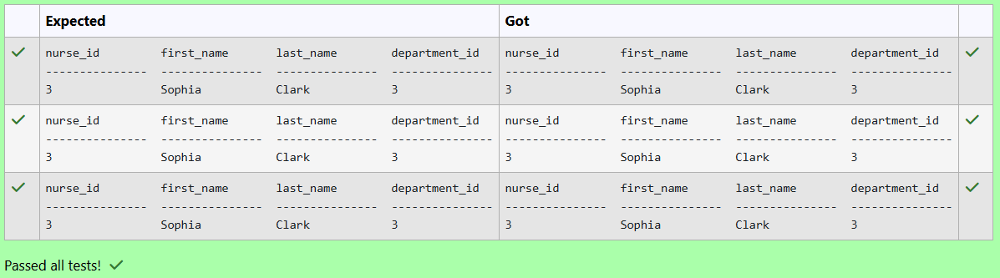

**Question 2**
---
SQL statement to generate a report with customer name, city, order number, order date, order amount, salesperson name, and commission to determine if any of the existing customers have not placed orders or if they have placed orders through their salesman or by themselves.

Sample table: customer
```
 customer_id |   cust_name    |    city    | grade | salesman_id 
-------------+----------------+------------+-------+-------------
        3002 | Nick Rimando   | New York   |   100 |        5001
        3007 | Brad Davis     | New York   |   200 |        5001
        3005 | Graham Zusi    | California |   200 |        5002
        3008 | Julian Green   | London     |   300 |        5002
        3004 | Fabian Johnson | Paris      |   300 |        5006
        3009 | Geoff Cameron  | Berlin     |   100 |        5003
        3003 | Jozy Altidor   | Moscow     |   200 |        5007
        3001 | Brad Guzan     | London     |       |        5005
```
Sample table: orders
```
ord_no      purch_amt   ord_date    customer_id  salesman_id
----------  ----------  ----------  -----------  -----------
70001       150.5       2012-10-05  3005         5002
70009       270.65      2012-09-10  3001         5005
70002       65.26       2012-10-05  3002         5001
70004       110.5       2012-08-17  3009         5003
70007       948.5       2012-09-10  3005         5002
70005       2400.6      2012-07-27  3007         5001
70008       5760        2012-09-10  3002         5001
70010       1983.43     2012-10-10  3004         5006
70003       2480.4      2012-10-10  3009         5003
70012       250.45      2012-06-27  3008         5002
70011       75.29       2012-08-17  3003         5007
70013       3045.6      2012-04-25  3002         5001
```
Sample table: salesman
```
 salesman_id |    name    |   city   | commission 
-------------+------------+----------+------------
        5001 | James Hoog | New York |       0.15
        5002 | Nail Knite | Paris    |       0.13
        5005 | Pit Alex   | London   |       0.11
        5006 | Mc Lyon    | Paris    |       0.14
        5007 | Paul Adam  | Rome     |       0.13
        5003 | Lauson Hen | San Jose |       0.12
```

```sql
SELECT
    c.cust_name, 
    c.city,
    o.ord_no, 
    o.ord_date, 
    o.purch_amt AS 'Order Amount',
    s.name, 
    s.commission
FROM 
    customer c
LEFT JOIN 
    orders o ON c.customer_id = o.customer_id
LEFT JOIN salesman s ON 
    (o.salesman_id = s.salesman_id OR (o.salesman_id IS NULL AND c.salesman_id = s.salesman_id))
```

**Output:**


**Question 3**
---
Write the SQL query that achieves the selection of the "cust_name" column from the "customer" table (aliased as "c") and the "name" column from the "salesman" table (aliased as "s"), with a left join on the "salesman_id" column and a condition filtering for customers in the same city as the salesman.

Customer Table:
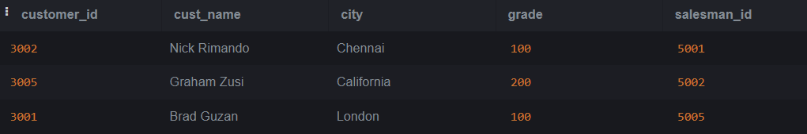


Salesmen Table:


```sql
SELECT c.cust_name , s.name
FROM customer c
LEFT JOIN salesman s ON c.salesman_id = s.salesman_id
WHERE c.city = s.city;
```

**Output:**

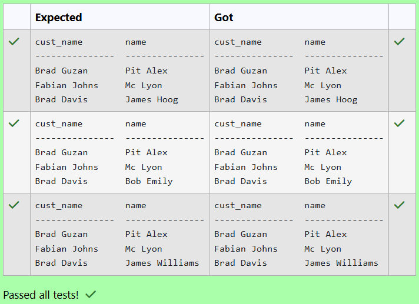

**Question 4**
---
Write a SQL statement to make a report with customer name, city, order number, order date, and order amount in ascending order according to the order date to determine whether any of the existing customers have placed an order or not.

Sample table: orders
```
ord_no      purch_amt   ord_date    customer_id  salesman_id
----------  ----------  ----------  -----------  -----------
70001       150.5       2012-10-05  3005         5002
70009       270.65      2012-09-10  3001         5005
70002       65.26       2012-10-05  3002         5001
70004       110.5       2012-08-17  3009         5003
70007       948.5       2012-09-10  3005         5002
70005       2400.6      2012-07-27  3007         5001
70008       5760        2012-09-10  3002         5001
70010       1983.43     2012-10-10  3004         5006
70003       2480.4      2012-10-10  3009         5003
70012       250.45      2012-06-27  3008         5002
70011       75.29       2012-08-17  3003         5007
70013       3045.6      2012-04-25  3002         5001
```
Sample table: customer
```
 customer_id |   cust_name    |    city    | grade | salesman_id 
-------------+----------------+------------+-------+-------------
        3002 | Nick Rimando   | New York   |   100 |        5001
        3007 | Brad Davis     | New York   |   200 |        5001
        3005 | Graham Zusi    | California |   200 |        5002
        3008 | Julian Green   | London     |   300 |        5002
        3004 | Fabian Johnson | Paris      |   300 |        5006
        3009 | Geoff Cameron  | Berlin     |   100 |        5003
        3003 | Jozy Altidor   | Moscow     |   200 |        5007
```
```sql
SELECT
    c.cust_name,
    c.city, 
    o.ord_no, 
    o.ord_date,
    o.purch_amt AS 'Order Amount'
FROM 
    customer c
LEFT JOIN
    orders o ON c.customer_id = o.customer_id
ORDER BY o.ord_date;
```

**Output:**

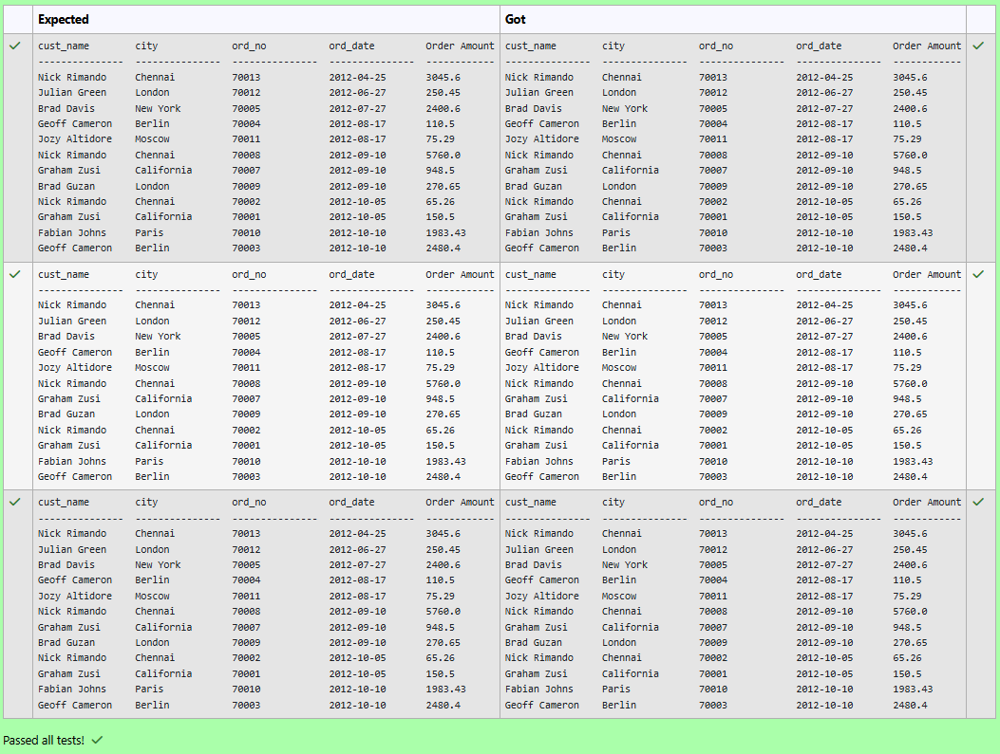

**Question 5**
---
Write the SQL query that achieves the selection of the "cust_name" column from the "customer" table (aliased as "c"), and the "ord_no," "ord_date," and "purch_amt" columns from the "orders" table (aliased as "o"), with a left join on the "customer_id" column.

CUSTOMER TABLE:


ORDERS TABLE:


```sql
SELECT c.cust_name, o.ord_no, ord_date, o.purch_amt
FROM customer c
LEFT JOIN orders o ON c.customer_id = o.customer_id;
```

**Output:**

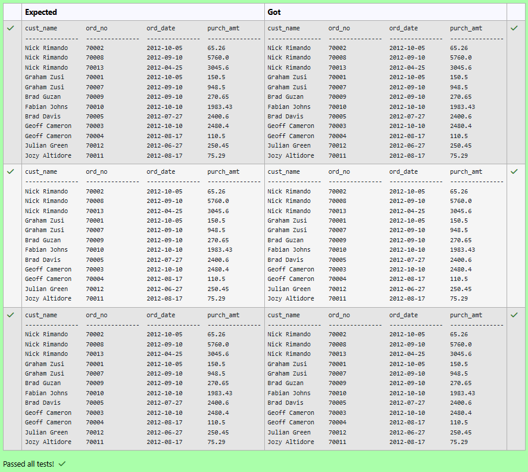

**Question 6**
---
From the following tables write a SQL query to find the details of an order. Return ord_no, ord_date, purch_amt, Customer Name, grade, Salesman, commission. 

Sample table: orders
```
ord_no      purch_amt   ord_date    customer_id  salesman_id
----------  ----------  ----------  -----------  -----------
70001       150.5       2012-10-05  3005         5002
70009       270.65      2012-09-10  3001         5005
70002       65.26       2012-10-05  3002         5001
70004       110.5       2012-08-17  3009         5003
70007       948.5       2012-09-10  3005         5002
70005       2400.6      2012-07-27  3007         5001
70008       5760        2012-09-10  3002         5001
70010       1983.43     2012-10-10  3004         5006
70003       2480.4      2012-10-10  3009         5003
70012       250.45      2012-06-27  3008         5002
70011       75.29       2012-08-17  3003         5007
70013       3045.6      2012-04-25  3002         5001
```
Sample table: customer
```
 customer_id |   cust_name    |    city    | grade | salesman_id 
-------------+----------------+------------+-------+-------------
        3002 | Nick Rimando   | New York   |   100 |        5001
        3007 | Brad Davis     | New York   |   200 |        5001
        3005 | Graham Zusi    | California |   200 |        5002
        3008 | Julian Green   | London     |   300 |        5002
        3004 | Fabian Johnson | Paris      |   300 |        5006
        3009 | Geoff Cameron  | Berlin     |   100 |        5003
        3003 | Jozy Altidor   | Moscow     |   200 |        5007
        3001 | Brad Guzan     | London     |       |        5005
```
Sample table: salesman
```
 salesman_id |    name    |   city   | commission 
-------------+------------+----------+------------
        5001 | James Hoog | New York |       0.15
        5002 | Nail Knite | Paris    |       0.13
        5005 | Pit Alex   | London   |       0.11
        5006 | Mc Lyon    | Paris    |       0.14
        5007 | Paul Adam  | Rome     |       0.13
        5003 | Lauson Hen | San Jose |       0.12
```
```sql
SELECT 
    a.ord_no, 
    a.ord_date, 
    a.purch_amt,
    b.cust_name AS "Customer Name", 
    b.grade,
    c.name AS "Salesman",
    c.commission
FROM orders a
INNER JOIN customer b ON a.customer_id = b.customer_id
INNER JOIN salesman c ON a.salesman_id = c.salesman_id;
```

**Output:**

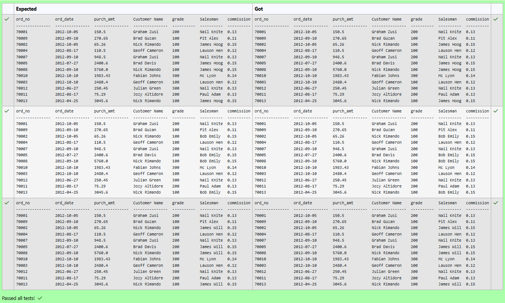

**Question 7**
---
From the following tables write a SQL query to locate those salespeople who do not live in the same city where their customers live and have received a commission of more than 12% from the company. Return Customer Name, customer city, Salesman, salesman city, commission.  

Sample table: customer
```
 customer_id |   cust_name    |    city    | grade | salesman_id 
-------------+----------------+------------+-------+-------------
        3002 | Nick Rimando   | New York   |   100 |        5001
        3007 | Brad Davis     | New York   |   200 |        5001
        3005 | Graham Zusi    | California |   200 |        5002
        3008 | Julian Green   | London     |   300 |        5002
        3004 | Fabian Johnson | Paris      |   300 |        5006
        3009 | Geoff Cameron  | Berlin     |   100 |        5003
        3003 | Jozy Altidor   | Moscow     |   200 |        5007
        3001 | Brad Guzan     | London     |       |        5005
```
Sample table: salesman
```
 salesman_id |    name    |   city   | commission 
-------------+------------+----------+------------
        5001 | James Hoog | New York |       0.15
        5002 | Nail Knite | Paris    |       0.13
        5005 | Pit Alex   | London   |       0.11
        5006 | Mc Lyon    | Paris    |       0.14
        5007 | Paul Adam  | Rome     |       0.13
        5003 | Lauson Hen | San Jose |       0.12
```
```sql
SELECT
    c.cust_name AS "Customer Name",
    c.city,
    s.name AS "Salesman",
    s.city,
    s.commission
FROM
    customer c
JOIN
    salesman s ON c.salesman_id = s.salesman_id
WHERE
    c.city <> s.city AND s.commission > 0.12;
```

**Output:**

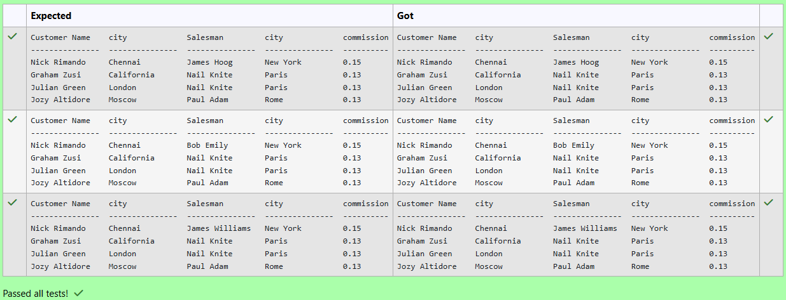

**Question 8**
---
 From the following tables write a SQL query to find the salesperson(s) and the customer(s) he represents. Return Customer Name, city, Salesman, commission.

Sample table: customer
```
 customer_id |   cust_name    |    city    | grade | salesman_id 
-------------+----------------+------------+-------+-------------
        3002 | Nick Rimando   | New York   |   100 |        5001
        3007 | Brad Davis     | New York   |   200 |        5001
        3005 | Graham Zusi    | California |   200 |        5002
        3008 | Julian Green   | London     |   300 |        5002
        3004 | Fabian Johnson | Paris      |   300 |        5006
        3009 | Geoff Cameron  | Berlin     |   100 |        5003
        3003 | Jozy Altidor   | Moscow     |   200 |        5007
        3001 | Brad Guzan     | London     |       |        5005
```
Sample table: salesman
```
 salesman_id |    name    |   city   | commission 
-------------+------------+----------+------------
        5001 | James Hoog | New York |       0.15
        5002 | Nail Knite | Paris    |       0.13
        5005 | Pit Alex   | London   |       0.11
        5006 | Mc Lyon    | Paris    |       0.14
        5007 | Paul Adam  | Rome     |       0.13
        5003 | Lauson Hen | San Jose |       0.12
```
```sql
SELECT 
    c.cust_name AS "Customer Name",
    c.city,
    s.name AS "Salesman",
    s.commission
FROM customer c
JOIN salesman s ON c.salesman_id = s.salesman_id;
```

**Output:**

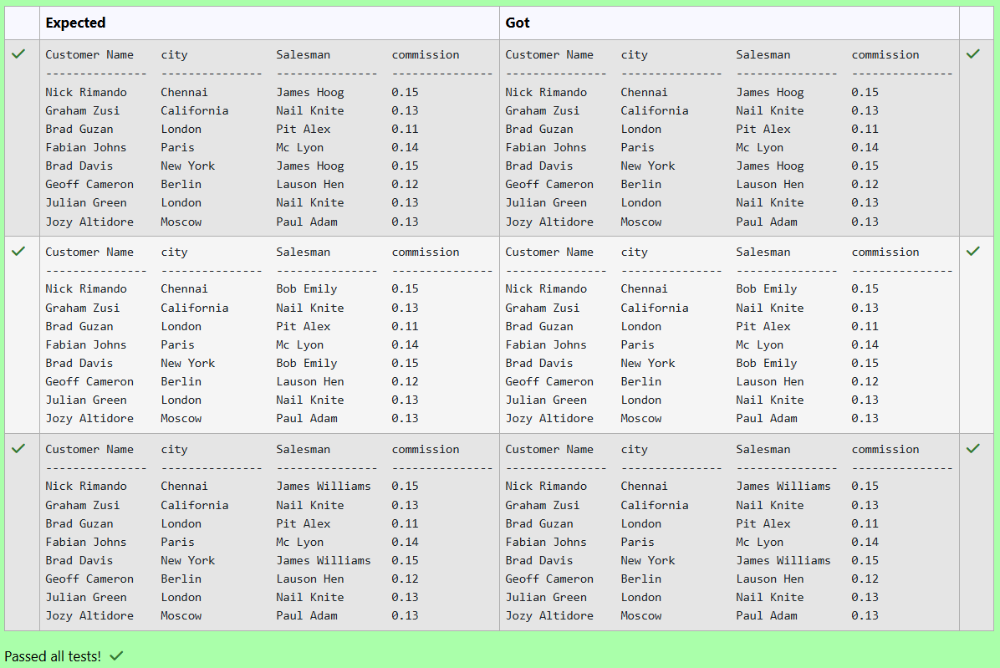

**Question 9**
---
Write the SQL query that achieves the selection of the first name from the "patients" table and all columns from the "surgeries" table, with an inner join on the "patient_id" column and a condition filtering for patients with a date of birth after '1990-01-01'.

PATIENTS TABLE:
```
name             type
---------------  ---------------
patient_id       INT
first_name       VARCHAR(50)
last_name        VARCHAR(50)
date_of_birth    DATE
admission_date   DATE
discharge_date   DATE
doctor_id        INT
```
SURGERIES TABLE:
```
name             type
---------------  ---------------
surgery_id       INT
patient_id       INT
surgeon_id       INT
surgery_date     DATE
```
```sql
SELECT 
    p.first_name,
    s.surgery_id,
    s.patient_id,
    s.surgeon_id,
    s.surgery_date
FROM patients p
INNER JOIN surgeries s ON p.patient_id = s.patient_id
WHERE p.date_of_birth > '1990-01-01';
```

**Output:**

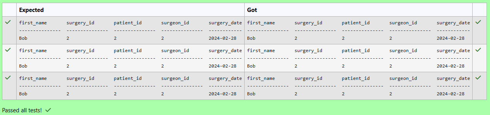

**Question 10**
---
Write the SQL query that achieves the selection of the first name from the "patients" table (aliased as "patient_name") and all columns from the "appointments" table (aliased as "a"), with an inner join on the "patient_id" column.

PATIENTS TABLE:

ATTRIBUTES - patient_id, first_name, last_name, date_of_birth, admission_date, discharge_date, doctor_id
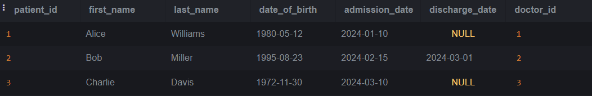


APPOINTMENTS TABLE:

ATTRIBUTES - appointment_id, patient_id, doctor_id, appointment_date


```sql
SELECT 
    p.first_name AS patient_name,
    a.appointment_id,
    a.patient_id,
    a.doctor_id,
    a.appointment_date
FROM patients p
INNER JOIN appointments a ON p.patient_id = a.patient_id;
```

**Output:**

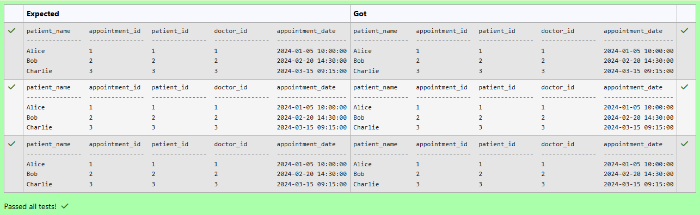

## RESULT
Thus, the SQL queries to implement different types of joins have been executed successfully.
