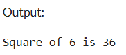
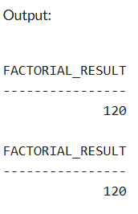
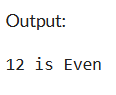
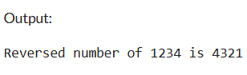
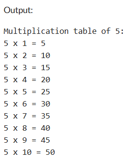

# Experiment 9: PL/SQL – Procedures and Functions

## AIM

To understand and implement procedures and functions in PL/SQL for performing various operations such as calculations, decision-making, and looping.

---

## THEORY

PL/SQL (Procedural Language/SQL) extends SQL by adding procedural constructs like variables, conditions, loops, procedures, and functions. Procedures and functions are subprograms that help modularize the code and improve reusability.

### **Procedure**

A PL/SQL **procedure** is a subprogram that performs a specific action. It does not return a value directly but can return values using `OUT` parameters.

**Syntax:**

```sql
CREATE OR REPLACE PROCEDURE procedure_name (parameters)
IS
BEGIN
   -- statements
END;
```

To call the procedure

```sql
EXEC procedure_name(arguments);
```

### **Function**

A PL/SQL **function** is a subprogram that returns a single value using the RETURN keyword.

```sql
CREATE OR REPLACE FUNCTION function_name (parameters)
RETURN datatype
IS
BEGIN
   -- statements
   RETURN value;
END;
```

To call the function:

```sql
SELECT function_name(arguments) FROM DUAL;
```

Key Differences:

-A procedure does not return a value, whereas a function must return a value.
-Functions can be called from SQL queries, procedures cannot (in most cases).

## 1. Write a PL/SQL Procedure to Find the Square of a Number

### Steps:

- Create a procedure named `find_square`.
- Declare a parameter to accept a number.
- Inside the procedure, compute the square of the input number.
- Use `DBMS_OUTPUT.PUT_LINE` to display the result.
- Call the procedure with a number as input.

**Program:**

```sql
CREATE OR REPLACE PROCEDURE find_square(n IN NUMBER)
IS
   square NUMBER;
BEGIN
   square := n * n;
   DBMS_OUTPUT.PUT_LINE('Square of ' || n || ' is ' || square);
END;
/

-- Call the procedure
BEGIN
   find_square(6);
END;
/
```

**Expected Output:**  
Square of 6 is 36

**Output:**



---

## 2. Write a PL/SQL Function to Return the Factorial of a Number

### Steps:

- Create a function named `get_factorial`.
- Declare a parameter to accept a number.
- Use a loop to calculate the factorial.
- Return the result using the `RETURN` statement.
- Call the function using a `SELECT` statement or in an anonymous block.

**Program:**

```sql
CREATE OR REPLACE FUNCTION get_factorial(n IN NUMBER)
RETURN NUMBER
IS
   result NUMBER := 1;
BEGIN
   FOR i IN 1..n LOOP
      result := result * i;
   END LOOP;
   RETURN result;
END;
/

-- Call using SELECT
SELECT get_factorial(5) AS factorial_result FROM DUAL;
```

**Expected Output:**  
Factorial of 5 is 120

**Output:**



---

## 3. Write a PL/SQL Procedure to Check Whether a Number is Even or Odd

### Steps:

- Create a procedure named `check_even_odd`.
- Accept an input parameter.
- Use the `MOD` function to check if the number is divisible by 2.
- Display whether it is Even or Odd using `DBMS_OUTPUT.PUT_LINE`.

**Program:**

```sql
CREATE OR REPLACE PROCEDURE check_even_odd(n IN NUMBER)
IS
BEGIN
   IF MOD(n, 2) = 0 THEN
      DBMS_OUTPUT.PUT_LINE(n || ' is Even');
   ELSE
      DBMS_OUTPUT.PUT_LINE(n || ' is Odd');
   END IF;
END;
/

-- Call the procedure
BEGIN
   check_even_odd(12);
END;
/
```

**Expected Output:**  
12 is Even

**Output:**



---

## 4. Write a PL/SQL Function to Return the Reverse of a Number

### Steps:

- Create a function named `reverse_number`.
- Accept an input number as parameter.
- Use a loop to reverse the digits of the number.
- Return the reversed number.
- Call the function and display the output.

**Program:**:
```sql
CREATE OR REPLACE FUNCTION reverse_number(n IN NUMBER)
RETURN NUMBER
IS
   rev NUMBER := 0;
   digit NUMBER;
   temp NUMBER := n;
BEGIN
   WHILE temp > 0 LOOP
      digit := MOD(temp, 10);
      rev := rev * 10 + digit;
      temp := TRUNC(temp / 10);
   END LOOP;
   RETURN rev;
END;
/

-- Call the function
DECLARE
   result NUMBER;
BEGIN
   result := reverse_number(1234);
   DBMS_OUTPUT.PUT_LINE('Reversed number of 1234 is ' || result);
END;
/
```

**Expected Output:**  
Reversed number of 1234 is 4321

**Output:**


---

## 5. Write a PL/SQL Procedure to Display the Multiplication Table of a Number

### Steps:

- Create a procedure named `print_table`.
- Accept an input number.
- Use a loop from 1 to 10 to multiply the input number.
- Display the multiplication results using `DBMS_OUTPUT.PUT_LINE`.

**Program:**
```sql
CREATE OR REPLACE PROCEDURE print_table(n IN NUMBER)
IS
BEGIN
   DBMS_OUTPUT.PUT_LINE('Multiplication table of ' || n || ':');
   FOR i IN 1..10 LOOP
      DBMS_OUTPUT.PUT_LINE(n || ' x ' || i || ' = ' || (n * i));
   END LOOP;
END;
/

-- Call the procedure
BEGIN
   print_table(5);
END;
/
```

**Expected Output:**  
Multiplication table of 5:  
5 x 1 = 5  
5 x 2 = 10  
5 x 3 = 15  
...  
5 x 10 = 50

**Output:**



## RESULT

Thus, the PL/SQL programs using procedures and functions were written, compiled, and executed successfully.
